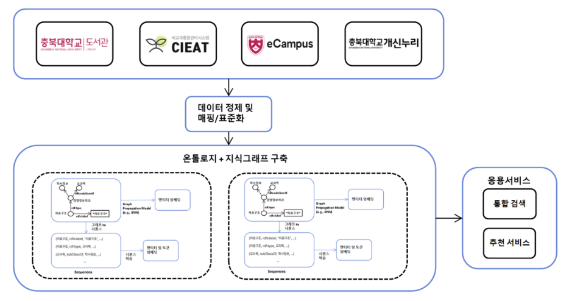
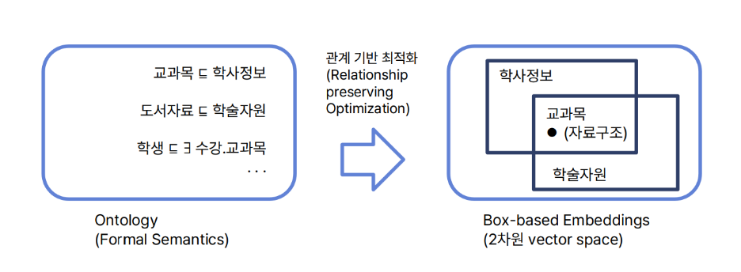
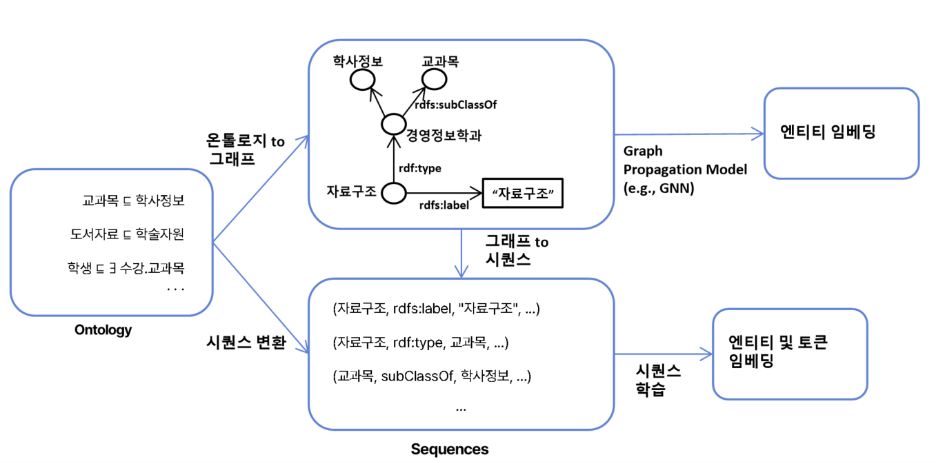

# CBNU Campus Ontology

충북대학교의 분산된 도서관, 학사행정, LMS, 비교과 정보를 Neo4j 지식그래프로 통합해 복합 질의와 추천 서비스를 구현하고자 했습니다.

이 프로젝트의 목표는 학생, 과목, 도서, 비교과 프로그램, 장학금, 학사일정, 전공 트랙 사이의 관계를 그래프로 연결해한 번에 탐색해 보는 것 입니다.

## Why I Built This

대학 정보 시스템은 보통 기능별로 분리되어 있습니다.
도서관은 도서관대로, 학사행정은 학사행정대로, LMS는 LMS대로, 비교과 시스템은 비교과 시스템대로 동작합니다. 
학생 입장에서는 과목, 추천 도서, 장학 조건, 비교과 프로그램, 졸업 요건을 확인하기 위해 여러 사이트를 반복해서 오가야 합니다.

행정 입장에서도 같은 문제가 생깁니다. 이미 게시된 공지나 규정이 있어도 학생 문의는 반복되고, 학사, 수강, 장학, 비교과 데이터를 매번 수동으로 결합해야 합니다. 
특히 "자료구조를 듣는 3학년 학생에게 연결되는 추천 도서, 비교과 프로그램, 장학금은 무엇인가?" 같은 복합 질문은 기존 테이블/게시판 중심 구조만으로는 바로 처리하기 어렵습니다.

그래서 캠퍼스 데이터를 온톨로지 기반 지식그래프로 모델링하고, Neo4j에서 관계 중심 질의를 수행하는 구조를 구현해보았습니다.

## Design Intuition



이 프로젝트는 흩어진 캠퍼스 정보를 하나의 지도로 다시 그리는 작업에 가깝습니다. 도서관, 학사행정, LMS, 비교과, 학과 공지는 각각 다른 건물에 붙은 안내문처럼 따로 존재합니다. 학생은 필요한 정보를 찾기 위해 건물을 계속 옮겨 다니고, 행정은 여러 안내문을 손으로 대조해야 합니다.

위 아키텍처 그림은 그 흩어진 안내문을 하나의 캠퍼스 지도 위에 다시 꽂는 흐름을 보여줍니다.

1. 도서관, 학사행정, LMS, 비교과, 학과 공지 데이터를 입력 소스로 둡니다.
2. ETL 단계에서 CSV 또는 합성 샘플 데이터를 정제하고 표준 속성으로 맞춥니다.
3. 온톨로지 스키마에 따라 Neo4j 노드와 관계로 적재합니다.
4. 학생 맥락 조회, 과목별 리소스 조회, 장학/비교과 추천 같은 그래프 질의를 실행합니다.



온톨로지는 정보들을 같은 기준으로 정렬하기 위한 개념 지도입니다. 예를 들어 `Student`, `Course`, `Program`, `Scholarship`을 각각 독립된 목록으로 보면 연결이 잘 보이지 않습니다. 하지만 각 개념을 영역으로 놓고 보면, 특정 학생이 듣는 과목, 그 과목과 관련된 비교과, 그 비교과를 요구하는 장학금처럼 겹치는 부분을 찾을 수 있습니다.



그래프는 관계를 따라 이동할 수 있는 길입니다. 학생에서 과목으로, 과목에서 추천 도서로, 과목에서 비교과 프로그램으로, 비교과에서 장학금으로 이동하면 기존 게시판 검색으로는 한 번에 보기 어려운 맥락이 만들어집니다.

이 파이프라인 그림은 그 관계망을 분석과 추천에 사용할 수 있는 형태로 정리하는 관점을 보여줍니다.

## Knowledge Graph Model

이 저장소에는 두 수준의 모델이 들어 있습니다.

`neo4j_loader.py`는 시각화 결과를 위한 대규모 합성 그래프를 생성합니다. 학생 5,600명, 과목 260개, 비교과 프로그램 100개, 장학금 50개, 도서 500개, 학과 20개, 전공 트랙 30개, 학사일정 40개 규모의 데이터를 만들어 Neo4j에 적재합니다.

`cbnu_ontology_poc/src` 패키지는 CSV 기반 ETL을 테스트 가능한 단위로 나눈 코어 구현입니다. 실제 CSV 파일을 `data/`에 넣고 `Student`, `Course`, `Book`, `Program`, `Scholarship`, `Department` 노드와 관계를 적재할 수 있게 구성했습니다.

### Main Labels

| Label                                 | Meaning          | Example                          |
| ------------------------------------- | ---------------- | -------------------------------- |
| `Student`                             | 학생             | 학번, 이름, 학년, 상태           |
| `Course`                              | 교과목           | 과목명, 학점, 학과, 수업 유형    |
| `Book`                                | 추천/참고 도서   | 제목, 저자, 주제, 대출 가능 여부 |
| `NonCurricularProgram` / `Program`    | 비교과 프로그램  | 역량, 대상 학과, 대상 학년       |
| `Scholarship`                         | 장학금           | 최소 GPA, 요구 학점, 대상 트랙   |
| `Department`, `College`, `MajorTrack` | 조직과 전공 구조 | 단과대, 학과, 전공 트랙          |
| `Term`, `AcademicEvent`               | 학기와 학사일정  | 수강신청, 중간고사, 졸업 점검    |

### Main Relationships

| Relationship                                                           | Meaning                       |
| ---------------------------------------------------------------------- | ----------------------------- |
| `(:Student)-[:ENROLLED_IN]->(:Course)`                                 | 학생이 수강 중인 과목         |
| `(:Course)-[:HAS_RECOMMENDED_BOOK]->(:Book)`                           | 과목에 연결된 추천 도서       |
| `(:Course)-[:RELATED_TO_PROGRAM]->(:NonCurricularProgram)`             | 과목과 관련된 비교과 프로그램 |
| `(:Scholarship)-[:REQUIRES_COURSE]->(:Course)`                         | 장학금 신청에 필요한 과목     |
| `(:Scholarship)-[:REQUIRES_PROGRAM]->(:NonCurricularProgram)`          | 장학금 신청에 필요한 비교과   |
| `(:Student)-[:MAJOR_IN]->(:MajorTrack)`                                | 학생의 전공 트랙              |
| `(:MajorTrack)-[:BELONGS_TO]->(:Department)-[:BELONGS_TO]->(:College)` | 전공/학과/단과대 구조         |
| `(:Course)-[:HELD_IN_TERM]->(:Term)`                                   | 과목이 열린 학기              |
| `(:AcademicEvent)-[:RELATED_TO_COURSE]->(:Course)`                     | 학사일정과 관련 과목          |

## Results

### Full Knowledge Graph


전체 그래프는 학생, 수강 과목, 추천 도서, 비교과, 장학금, 전공/학과 구조가 하나의 네트워크로 연결되는 모습을 보여줍니다. 기존 시스템에서는 각각 다른 화면에서 확인해야 하는 정보가 관계 기반으로 이어지므로, 학생 단위의 맥락 조회가 가능해집니다.

### Program and Academic Event Graph


비교과 프로그램과 학사일정을 연결한 그래프입니다. 특정 학년이나 학기 이벤트에 맞춰 어떤 비교과 프로그램이 적합한지 탐색할 수 있습니다. 단순 프로그램 목록보다 실제 학사 흐름과 함께 볼 수 있다는 점이 중요합니다.

### Course Enrollment and Book Graph


`Data Structures` 과목을 중심으로 수강 학생과 추천 도서가 어떻게 연결되는지 보여줍니다. 이 구조를 확장하면 과목별 학습 리소스 추천, 대출 가능 도서 안내, 동일 과목 수강생의 학습 네트워크 분석으로 이어질 수 있습니다.

### Major Track, Student, and Scholarship Graph


전공 트랙을 기준으로 학생과 장학금 정보를 연결한 그래프입니다. 이전 검토에서 정리한 것처럼 이 이미지는 단순 "학생 그래프"가 아니라 "전공 트랙 기반 학생/장학 탐색"을 보여주는 결과로 보는 편이 정확합니다.

### College, Department, and Major Structure


단과대, 학과, 전공 트랙의 계층 구조를 그래프로 표현합니다. 행정 조직과 학업 경로를 함께 모델링하면 학과별 프로그램 추천, 전공별 장학 조건 탐색, 조직 단위 통계 분석의 기준점으로 사용할 수 있습니다.

## How to Run

### Requirements

- Python 3.11+
- Neo4j 5.x 또는 Neo4j Aura
- pip / virtualenv

```powershell
python -m venv .venv
.\.venv\Scripts\activate
pip install -r requirements.txt
```

Neo4j 접속 정보는 환경 변수로 지정합니다.

```powershell
$env:NEO4J_URI="bolt://localhost:7687"
$env:NEO4J_USER="neo4j"
$env:NEO4J_PASSWORD="your-password"
```

대규모 합성 샘플 그래프를 생성하려면 다음 명령을 실행합니다.

```powershell
cd cbnu_ontology_poc
python neo4j_loader.py
```

실행이 끝나면 Neo4j Browser에서 `MATCH (n) RETURN n LIMIT 100` 같은 질의로 그래프를 확인할 수 있습니다.

## CSV ETL Mode

`cbnu_ontology_poc/data/`에 다음 CSV 파일을 넣으면 `src/graph/graph_builder.py`의 적재 로직을 사용할 수 있습니다.

| File               | Required Columns                                         |
| ------------------ | -------------------------------------------------------- |
| `students.csv`     | `student_id`, `name`, `dept_id`, `year`, `status`        |
| `courses.csv`      | `course_id`, `name`, `dept_id`, `credit`, `type`         |
| `books.csv`        | `book_id`, `title`, `author`, `topic`, `available`       |
| `programs.csv`     | `program_id`, `name`, `target_dept_id`, `skill_tag`      |
| `scholarships.csv` | `scholarship_id`, `name`, `min_gpa`, `required_credit`   |
| `departments.csv`  | `dept_id`, `name`                                        |
| `relations.csv`    | `from_label`, `from_id`, `rel_type`, `to_label`, `to_id` |

코어 질의는 `src/queries/core_queries.py`에 들어 있습니다.

- `get_student_context(client, student_id)`: 학생, 수강 과목, 추천 도서, 관련 비교과, 장학금을 조회합니다.
- `get_course_resources(client, course_id)`: 과목 기준 추천 도서, 관련 비교과, 장학금을 조회합니다.

## Validation

단위 테스트는 Neo4j 서버 없이 Fake 클라이언트로 ETL, 그래프 적재, 핵심 질의를 검증합니다.

```powershell
pytest cbnu_ontology_poc\tests\test_etl.py cbnu_ontology_poc\tests\test_graph_builder.py cbnu_ontology_poc\tests\test_core_queries.py
```

실제 Neo4j 적재까지 검증하려면 Neo4j 서버를 실행하고 환경 변수를 지정한 뒤 통합 테스트를 실행합니다.

```powershell
pytest cbnu_ontology_poc\tests\test_neo4j_loader_integration.py
```

## Repository Layout

```text
campus-ontology/
|-- README.md
|-- requirements.txt
|-- docs/
|   `-- images/
|       |-- architecture.png
|       |-- all.png
|       |-- program.png
|       |-- datastructure.png
|       |-- student.png
|       |-- college_department.png
|       |-- ontology-box-embedding.png
|       `-- graph-embedding-pipeline.png
`-- cbnu_ontology_poc/
    |-- neo4j_loader.py
    |-- data/
    |-- src/
    |   |-- ontology_schema.py
    |   |-- etl/
    |   |-- graph/
    |   `-- queries/
    `-- tests/
```
